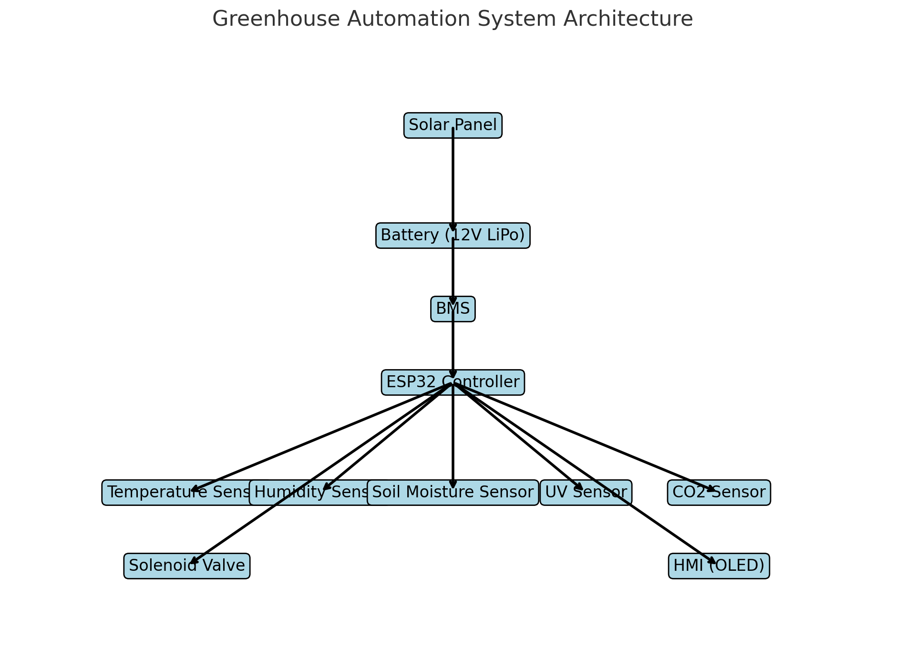

# Greenhouse Automation Project

## Overview
This project aims to automate a home greenhouse using a combination of sensors, controllers, and power sources. The goal is to create a self-sustaining system that monitors and regulates environmental conditions to optimize plant growth.

## 1. Power Source
### Options:
- **Wind**
- **Water**
- **Solar**

### Recommendations:
- **Solar Power:** The most practical option for a home greenhouse. Use solar panels to charge a battery that powers the system.
- **Battery:** A 12V LiPo battery is recommended. Calculate the required capacity based on power consumption needs.
- **Battery Management System (BMS):** Ensure compatibility with the battery voltage and include protections like overcharge, discharge, and short-circuit.

## 2. Controller
### Option:
- **ESP32**

### Recommendations:
- The ESP32 is a powerful microcontroller with Wi-Fi and Bluetooth capabilities, ideal for IoT applications.
- **Programming:** Use Arduino IDE or MicroPython.
- **Connectivity:** Utilize Wi-Fi for remote monitoring and control of greenhouse parameters.

## 3. Sensors
### Types of Sensors:
- **Temperature Sensor:** e.g., DHT22 or DS18B20
- **Humidity Sensor:** e.g., DHT22 (combined with temperature) or standalone like SHT31
- **Soil Moisture Sensor:** Capacitive sensors are recommended for durability.
- **Light Sensor (UV):** e.g., ML8511 for UV intensity measurement
- **CO2 Sensor:** e.g., MH-Z19B
- **Battery Level Monitor:** Voltage dividers or dedicated battery monitoring ICs

### Recommendations:
- Ensure all sensors are compatible with the ESP32 in terms of voltage and communication protocol (I2C, analog, etc.).
- Calibrate sensors after installation for accurate measurements.

## 4. Solenoid Valve
### Type:
- **12V DC solenoid valve**

### Recommendations:
- Ensure the valve is rated for the water pressure in your greenhouse irrigation system.
- **Manual Override:** Include a manual valve or switch to enable water flow in case of system failure.

## 5. Human-Machine Interface (HMI)
### Options:
- **LCD/OLED Display:** Use an OLED display for better contrast and visibility in different lighting conditions.
- **Buttons vs. Touch Interface:** Capacitive touch buttons or physical buttons based on personal preference.

### Recommendations:
- Keep the interface simple for easy interaction. Consider a touch interface for ease of use, especially in humid conditions or when wearing gloves.

## 6. Additional Considerations
### Data Logging and Monitoring:
- Store data locally on an SD card or send it to a cloud service for long-term analysis.
- Use MQTT or HTTP protocols to send data to a smartphone or web dashboard for real-time monitoring.

### Automated Irrigation Logic:
- Program the controller to open the solenoid valve based on soil moisture levels.
- Include threshold settings for temperature and humidity to trigger ventilation or heating systems.

### Backup Power:
- Consider a secondary power source (like a backup battery) to keep essential systems running during power failures or extended periods without sunlight.

### Environmental Controls:
- Integrate with fans or heaters to maintain optimal temperature and humidity levels.
- Potential integration with grow lights for low-light conditions.

## 7. Future Expansions
### Advanced Automation:
- Implement machine learning algorithms to optimize watering schedules based on historical data.

### Security:
- Implement a camera system to monitor the greenhouse remotely.

## 8. Development and Testing
### Prototyping:
- Start with a basic setup including the power source, ESP32, and one or two sensors.
- Test the system’s response to different environmental conditions.

### Iterative Improvement:
- Gradually integrate additional sensors, automation features, and the HMI.
- Continuously refine the control logic based on testing outcomes.

## 9. Implementation and Maintenance
### Installation:
- Ensure all components are weatherproof or protected from the greenhouse environment.

### Maintenance:
- Regularly check battery health, sensor calibration, and system operation.
  
## Conclusion
This plan provides a comprehensive guide for developing and implementing a greenhouse automation project. As you proceed, keep testing and refining the system to ensure it meets your needs effectively.

This diagram illustrates the architecture of the greenhouse automation system, showing the connections between various components:

## Component Descriptions:
- **Solar Panel:** Provides power to the system by charging the battery.
- **Battery (12V LiPo):** Stores energy from the solar panel to power the system when needed.
- **BMS:** Battery Management System, ensures safe operation of the battery by managing charge/discharge cycles.
- **ESP32 Controller:** The central controller that handles data from sensors and controls the solenoid valve and HMI.
- **Temperature Sensor:** Monitors the temperature inside the greenhouse.
- **Humidity Sensor:** Tracks the humidity levels inside the greenhouse.
- **Soil Moisture Sensor:** Measures the moisture content in the soil.
- **UV Sensor:** Detects the amount of ultraviolet light in the greenhouse.
- **CO2 Sensor:** Measures the concentration of CO2 inside the greenhouse.
- **Solenoid Valve:** Controls water flow for irrigation, activated based on soil moisture levels.
- **HMI (OLED):** Provides a user interface to monitor system status and adjust settings.

## System Flow:
1. The **Solar Panel** charges the **Battery**.
2. The **Battery** is managed by the **BMS** to ensure safe charging and discharging.
3. The **ESP32 Controller** is powered by the battery and controls all sensors and actuators.
4. Sensors (Temperature, Humidity, Soil Moisture, UV, CO2) send data to the **ESP32 Controller**.
5. Based on sensor data, the **ESP32 Controller** activates the **Solenoid Valve** to control irrigation.
6. The **HMI (OLED)** allows users to interact with the system and monitor data.

This setup ensures that the greenhouse environment is automatically controlled to optimize plant growth.

